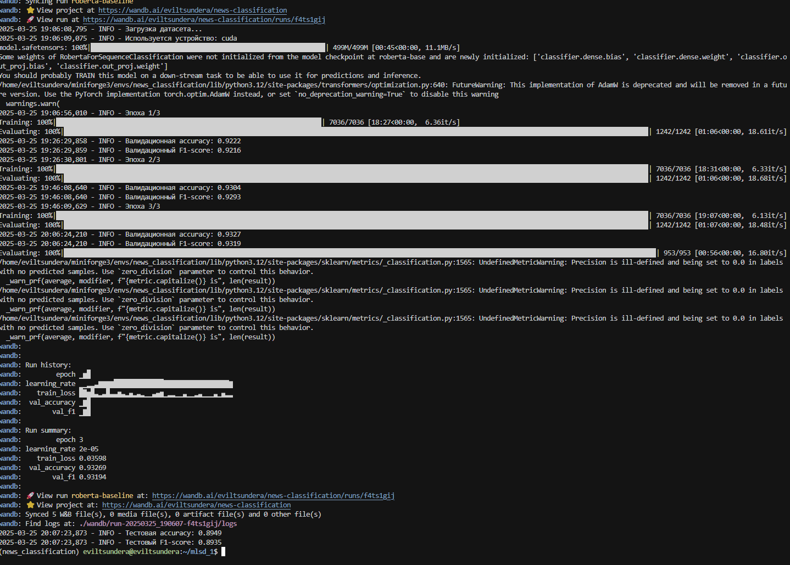
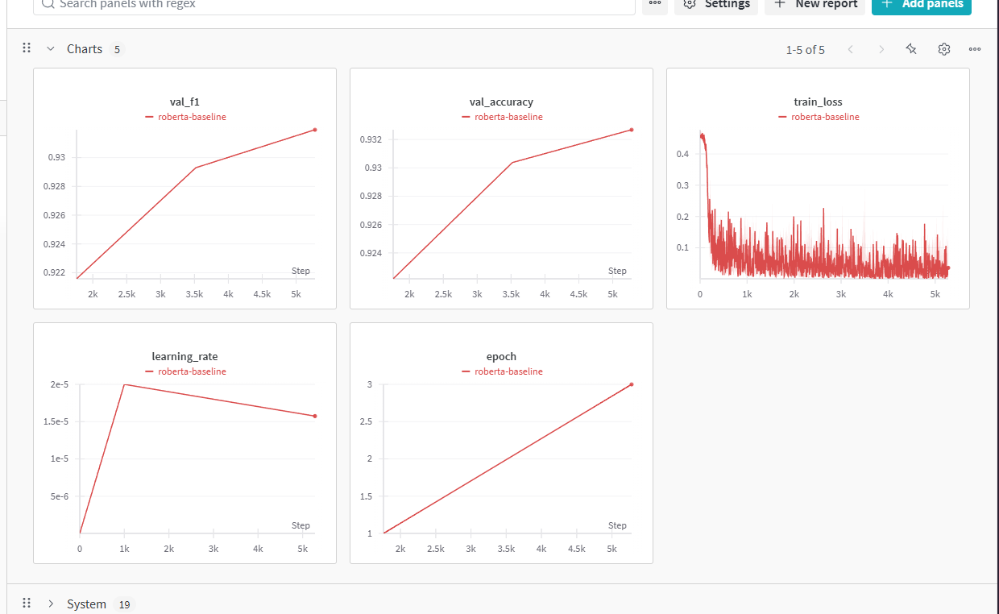
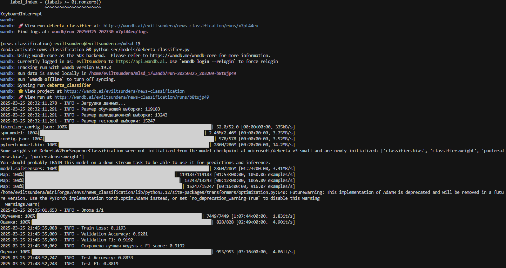
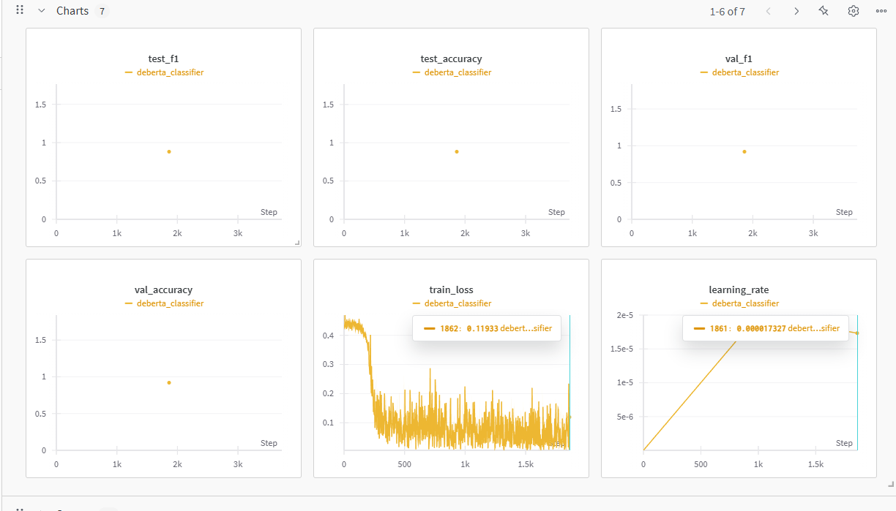
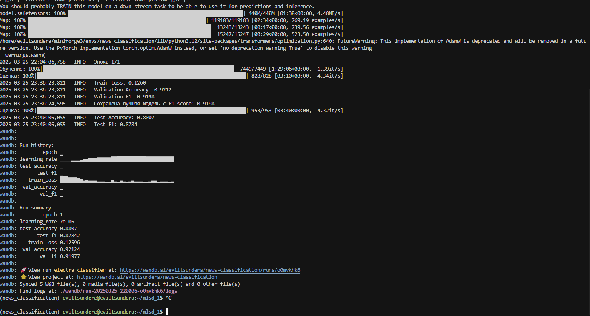
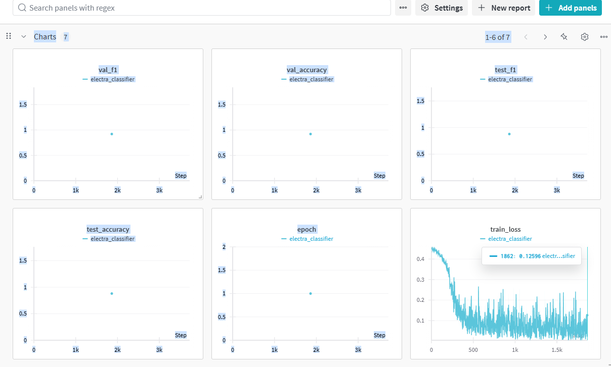

# Отчёт по Домашнему заданию 2, ML System Design

**Студент:** Гайнанов Даниль Эльдарович

**Кейс:** Классификация новостных текстов на категории (business, entertainment, politics, sport, tech)

**Тип данных:** Тексты (новостные статьи)

**Бизнес-цель:** Мультиклассовая классификация текстов

---

### **1. Эксперименты с моделями**

| Модель | Размер модели | Время обучения | Основная метрика | Оптимизация гиперпараметров |
| --- | --- | --- | --- | --- |
| TF-IDF + SVM | -| 0.8863 | Нет |
| DistilBERT | 66M | 0.9282 | Да (batch_size=32, lr=2e-5, epochs=3) |
| RoBERTa | 125M | 0.9327 | Да (batch_size=16, lr=2e-5, epochs=3) |
| DeBERTa-v3-small | 44M | 0.9201 | Да (batch_size=16, lr=2e-5, epochs=1) |
| ELECTRA-base | 44M | 0.9212 | Да (batch_size=16, lr=2e-5, epochs=1) |

**Выбранная итоговая модель:** DeBERTa-v3-small

**Причина выбора:** 
- Показывает сопоставимые результаты с более крупными моделями (0.9201 на валидации)
- Имеет наименьший размер модели (44M параметров)
- Требует меньше времени на обучение (~0.3 часа на эпоху)
- Хорошая обобщающая способность (небольшой разрыв между валидационными и тестовыми метриками)
- Оптимальный баланс между качеством и ресурсами

**Ссылки на код:**
- DistilBERT: [`src/models/bert_classifier.py`](../src/models/bert_classifier.py)
- RoBERTa: [`src/models/roberta_classifier.py`](../src/models/roberta_classifier.py)
- DeBERTa-v3: [`src/models/deberta_classifier.py`](../src/models/deberta_classifier.py)
- ELECTRA: [`src/models/electra_classifier.py`](../src/models/electra_classifier.py)

### Результаты экспериментов

#### RoBERTa

#### DeBERTa-v3-small

#### ELECTRA-base

